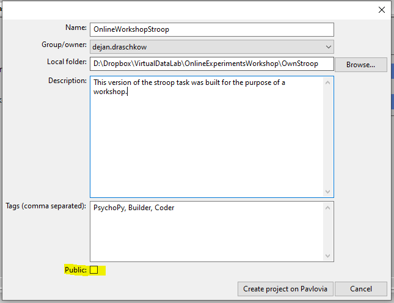
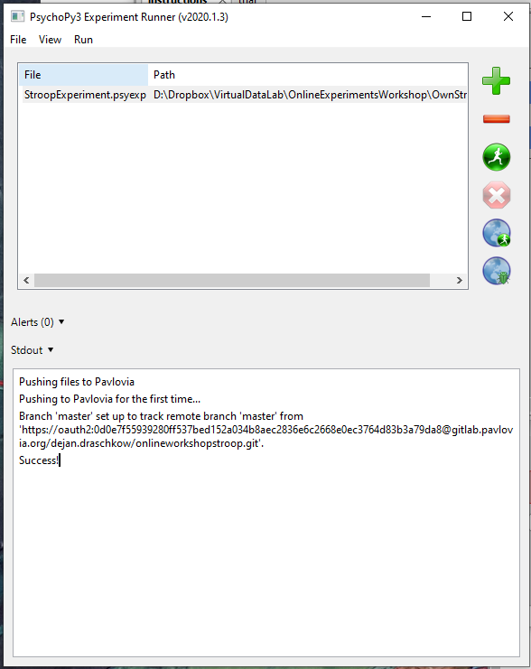
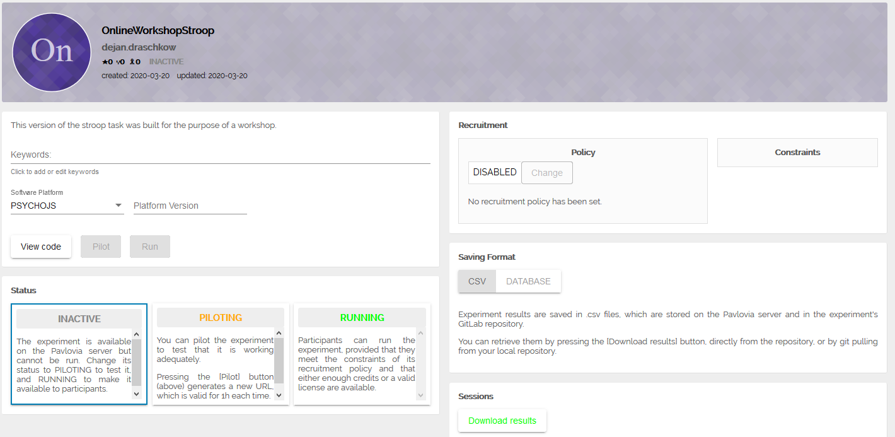

# **Chapter 2: Multiplexing between the on- and offline world**
In this chapter we will cover the interactions between the study you are editing locally (your computer) and the online implementation of that experiment. First, we will convert a functional simple offline experiment into a study which is available online. In order to maintain and edit this study, we will discuss version control and how this is implemented. Finally, we will dine on the fruits of other people's labor, by fetching an experiment that we found online in order to build upon it.

The **prerequisites** for successfully completing this chapter are to have  completed the following sections of Chapter 1: ```1.2. & 1.3.```. This includes creating the Stroop task by following the [online tutorial](https://www.youtube.com/watch?v=VV6qhuQgsiI) and creating an account on [Pavlovia](https://pavlovia.org/docs/home/about). The aim of these chapters is not to be fully comprehensive, but to provide structure, guidance and systematize valuable external resources. We strongly recommend to follow the links we provide in all chapters. It might not always be necessary to meticulously go through the linked materials, but it will be extremely helpful to skim the contents of the link before proceeding with the chapter.

# 1. Convert your offline study into an online experiment
To keep this simple and really focus on the issues that are specific to the "online" part of this challenge, we will use the Stroop task from the [online tutorial](https://www.youtube.com/watch?v=VV6qhuQgsiI). By now, you should have a working version of the experiment.

Your folder structure should look like this:


## 1.2. Create a Pavlovia project
We have an experimental folder called ```OwnStroop``` which contains all the relevant files for successful script execution on our local system. Our aim now is to synchronize this folder with a corresponding Pavlovia project - thus making the experimental files available to the server, which in turn will make them available to participants.

1. In case you haven't done so yet, now is the time to log in to your Pavlovia account via PsychoPy, by clicking on this button:


2. Now select ```Sync with web project```  and choose that you want to *create a new project*.

3. Give it a name, e.g. ```OnlineWorkshopStroop``` and select yourself as the owner of the project (maybe give it a different name, because later on we will download an experiment which is called exactly like this and it will get confusing). At this time you probably should **not** select the project to be publicly accessible. Note, that "public", really means "public" - so everybody could also access the data that you are collecting.



4. The next thing PsychoPy will ask you is to **commit** your changes. If you are familiar with [Git](https://www.atlassian.com/git/tutorials/what-is-git) or Git-hosting services such as Github or Gitlab, you will know what is going on here. We will expand on this more in section ```2.```, but essentially from now on every time you make a change to your project, you will need to commit this change - marking it as such, which helps you track changes made to your code and also allows to recover previous versions of the code.


Hopefully, everything has worked out and you saw a ```Success!``` message in one of the console outputs.



## 1.2. Activate your study
Now that you have successfully created a project on Pavlovia, it is time to have a look at it. For this, you can navigate to the ```Experiments``` section of your [dashboard](https://pavlovia.org/dashboard).

When you select the experiment you have just created, you will stumble upon the landing page of this study. We will spend some time unpacking it.


1. **Status**: the titles and descriptions of the different Status options are quite self-explanatory. Importantly, in cases in which you don't have a license, the RUNNING status will not be available. The rest of the functionality will be completely accessible to you. So you can still build and test your experiments, just can't collect data. As we have a license, we can **select RUNNING as our status**.
2. **Running Mode**: hopefully this should say that you are covered by a license. (If not, please let us know, as we are managing the University of Oxford licenses.)
3. **Sessions**: here you get a small summary of the participation stats. You can also download the results.
4. Finally, and maybe most importantly, you can have a look at the actual file structure Pavlovia is using to run your study. For this, you can click on ```View code``` and we will cover this in section ```2.```.

Maybe now is a good time to actually run the study in your browser. Select the ```Pilot``` button which is next to ```View code```. Complete your own study in the browser, so we can have a look at the data file in the next section. **In case the experiment does not initialize, copy-paste the link from your current browser toolbar into a different browser (e.g. Chrome) and try again.**

## 1.3. Not *everything goes* online
PsychoPy is extremely feature-rich! Not all of these features are currently [supported for online testing](https://psychopy.org/online/status.html#onlinestatus). Make sure to frequently check if new features are added to the list.

# 2. Editing and syncing your experiment
Once the experiment is online, you might want to track the data coming in from participation, or adjust the experiment after receiving feedback. For this, we will need to understand the relationship between the study which lives on the server and the one that lives on your hard drive.

## 2.1. Synchronize online with offline
Compare the files in your local folder and the ones that you see on your GitLab project (click on ```View code```). Notice that the folder and file structures are identical. Except for one critical difference - which is in the ```data``` folder. Because you completed the study one time after hitting the ```Pilot``` button, the data file from this run has been saved to the  ```data``` folder on the server. Naturally, these files are not available to you locally yet. In order to synchronize between the local and the server version of your files, you can (and should) routinely click the ```Sync with web project```  button.

After syncing, the data files will be available in your local directory. Investigate the files, while we feed the [B&C lab](http://www.brainandcognition.org/) pet Gabi The Gecko.

## 2.2. Synchronize offline with online
If we want to synchronize changes made to local files with the server, we proceed in the analogical fashion.

For example, one thing that bothers us currently is the font size of the instruction. Far too big. So let's change that in our local experiment to ```0.05```.


If we now ```Sync with web project``` , we will have to stage a commit again.


You can see that your repository on the server was updated recently, and you can also click on the last commit message in order to see your commit history, that is the changes you have made to your files since you published the study.


# 3. Download a study from Pavlovia
Pavlovia has the nice feature of enabling the [sharing of experiments](https://pavlovia.org/explore) - with some more information [here](https://psychopy.org/online/usingPavlovia.html). On the one hand, it can help people to stop reinventing the wheel, and on the other hand, it can reward people who are sharing their experiments (so please click on the ```Star``` of repositories you like and use). Each of the studies [listed](https://pavlovia.org/explore) can be tested online. You can also see the code and the repository of these public studies.

You can manually download the files from a study you are interested in from the respective GitLab page.


But you can also search for available studies from within PsychoPy .

Please type ```OnlineWorkshopStroop``` into the search bar and hit ```Search```. Find the Stroop task created by Dejan Draschkow.

1. Click ```Browse``` to select a local root directory, i.e. the directory where the project you are downloading will live.
2. Navigate to an appropriate folder, create a new folder called "NewStroop" and select it.
3. Now pick ```Sync...``` which will download that task into that folder.

The folder will now contain all experimental files necessary for running the task.
