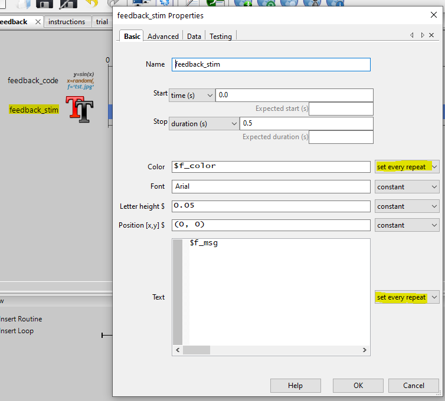
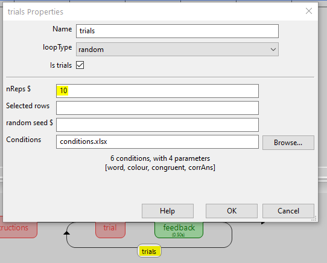
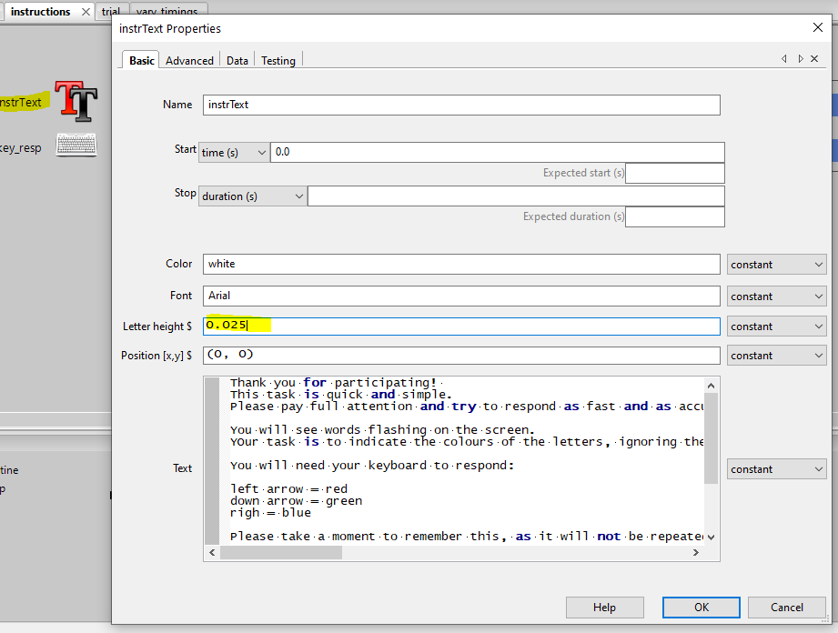

# **Chapter 3: Collecting data and troubleshooting online studies**
We will use this chapter to make the transition from more abstract discussions to some actual *real-life* problems of online experimenting, by setting up an actual study and collect real data.
In this chapter, we will modify our Stroop task with the help of Python **and** JavaScript code. Subsequently, we will adjust the study to be compatible with recruitment via [Prolific](https://www.prolific.co/) and actually *collect* one data set.

The **prerequisites** for successfully completing this chapter are: (1) have completed Chapters 1 & 2; (2) have an online Stroop task, which is set as **RUNNING** on Pavlovia ```Ch.2: 1.2.```; (3) have spent some time reading through the [documentation of Prolific](https://researcher-help.prolific.co/hc/en-gb). The aim of these chapters is not to be fully comprehensive, but to provide structure, guidance and systematize valuable external resources. We strongly recommend to follow the links we provide in all chapters. It might not always be necessary to meticulously go through the linked materials, but it will be extremely helpful to skim the contents of the link before proceeding with the chapter.

# 1. Using Python | JavaScript to modify experiment
In PsychoPy you can create a study by using the [Builder](https://psychopy.org/builder/index.html) (as you did when creating the Stroop task), or by using the [Coder](https://psychopy.org/coder/index.html). The Coder gives you more control and allows for a lot of customization, because your are essentially scripting everything from scratch. You **can't** switch back and forth between these two options for a single study. You can, however, compile your Builder experiment into not so easily readable Python code (usually good for quick glances under the hood). But you can't go the other way around - from Python code to Builder GUI. Critically, the developers of PsychoPy strongly recommend using the Builder and they always use it when building their own studies - even though they probably are the people least in need of a GUI. The reasons for this recommendation are manifold, from settings and timing-specific considerations, to the very convincing point of transferability. If you don't want to code your entire experiment in JavaScript from scratch, you can only use the Builder if you want to run a study online. As you witnessed in Chapter 2, experiments created via the Builder can be easily run both off- and online.

## 1.1. Code Components
As anyone who has ever worked with a GUI for experimental generation knows, such builders are usually insufficient for more complex designs. In order for them to remain simple, they are lacking the flexibility which is required to handle specific customization needs. Fortunately, PsychoPy provides an elegant way of meeting more complex design challenges - [Code Components](https://psychopy.org/builder/components/code.html). These components can be inserted at the desired locations within the experimental framework in order to solve more complex problems using code.  

## 1.2. Alter your study with Python code
Let's try out a Code Component. Maybe we want to give response contingent feedback after every word. That is, tell participants if they were correct or not.  

1. First, we need to add a new ```Routine```, place it within the ```trials``` loop, after the ```trial``` routine and name it ```feedback```.


2. In this new routine, we add a Code Component from the ```Components``` tab on the right, under ```Custom```.

3. Now we can code the conditional statement controlling when the message of the feedback will be "Correct" and depicted in green (vs. "Wrong" in red). Critically, the code needs to be placed inside the ```BeginRoutine``` tab, in order to be updated every trial.

  Here we are making use of a variable [automatically generated by PsychoPy](https://www.psychopy.org/recipes/builderFeedback.html), that is ```response.corr```. The value of this variable will be either "#None", "0" or "1", if you are using 'store correct' in your ```response``` component within the ```trial``` routine. Most components in PsychoPy offer such output variables and it is good to familiarize yourself with the [components that you are using](https://www.psychopy.org/builder/components/keyboard.html).

  *Note that PsychoPy is already out-converting your Python code into JavaScript if you have set ```Code Type``` to be ```Auto->JS```. More about this in section* ```1.3.```.

4. Finally, we have created the variables ```f_msg``` and ```f_color```, but we need to create a text component which actually presents the feedback. Luckily, we have already done something similar when presenting the colored words for the Stroop task.



Now, test if your feedback works locally and afterwards sync it to Pavlovia .

If the feedback is also working when you run your study online (like [this](https://run.pavlovia.org/dejan.draschkow/onlineworkshopstroop/html/)), then the only thing left is to (1) increase the amount of trials  to 10 per condition


and to make the instructions a bit more informative.
```
Thank you for participating!
This task is quick and simple.
Please pay full attention and try to respond
as fast and as accurate as possible.

You will see words flashing on the screen.
Your task is to indicate the colours of the letters,
ignoring the word.

You will need your keyboard to respond:

left arrow = red
down arrow = green
right arrow = blue

Please take a moment to remember this, as it will not be repeated.

Again, respond according to the colors of the LETTERS,
and IGNORE the meaning of the word.

Thank you for your time.


(This study is not part of a research project and
  is only used for educational purposes.)
```




Finally, (1) delete all the data files in the ```/data``` folder of your project, (2) sync this final and clean version of your project, (3) complete the online task yourself to see how long it takes and **(4) send the participation link** to one of your friends/colleagues in order to collect one pilot data set.

## 1.3. Translate from Python to JavaScript for online compatibility
Running experiments online requires the translation of everything you do into JavaScript. The Builder does this automatically - all [supported](https://www.psychopy.org/online/status.html#onlinestatus) drag-and-drop components will translate into JS. For Code Components this is a bit more difficult. A new feature of PsychoPy is that it automatically translates Python into JS if ```Code Type``` is set to ```Auto->JS```. This is quite elegant, but note that it ONLY works for base-Python syntax. Whenever you are using functions from specific libraries, you will need to find an equivalent solution in JS.

### 1.3.1. Functions from PsychoPy
For functions which are PsychoPy-specific, you will find corresponding [PsychoJS](https://psychopy.github.io/psychojs/) functions - that is the JavaScript implementation of some of the more popular PsychoPy functions.

### 1.3.1. Functions from other libraries
If you want to use functions from other packages, things can become a bit more hacky. You will need to look for solutions on the [forum](https://discourse.psychopy.org/) or simply search online - after all JavaScript is one of the most used languages in the world.

For example, very frequently used functions for experiments are the ones coming from the ```random``` library. If you would want to draw a random number between 8 and 14, you could do:
```Python
# this is how we comment in Python
import random
stim_loc = random.randint(8,14)
```

The function ```random.randint()``` comes from the library ```random```, thus the automatic Python->JS conversion will not know what to do and simply repeat the function. In fact we would need to set ```Code Type``` to ```Both``` and find a solution [online](https://developer.mozilla.org/de/docs/Web/JavaScript/Reference/Global_Objects/Math/math.random) or on the [forum](https://discourse.psychopy.org/t/random-number-generate-display-save/7155/2):
``` JavaScript
//this is how we comment in JS

//create our own function
//we use the Math library which is available
function getRndInteger(min, max) {
  min = Math.ceil(min);
  max = Math.floor(max);
  return Math.floor(Math.random()*(max-min+1))+min;
}
stim_loc = getRndInteger(8,14)
```

If you want to just play around with different JavaScript code snipplets and see what they do, we can recommend just using an [online JS editor](https://js.do/) in the beginning.

## 1.4. Have a look at the data
Once we are happy with our design and have collected our first pilot data, it is a good idea to evaluate the data and also check if we are storing all necessary variables.

First, we will need to collect the pilot data from the server. You can do this by simply syncing  your project, which will download all available data files to your local machine. Another way to get to the data is to download it directly from the [GitLab page of a/your project](https://gitlab.pavlovia.org/dejan.draschkow/onlineworkshopstroop/tree/master/data).

To analyze the data, you can use your favorite scripting language. Here, we will use R to interrogate the data files and provide an example.

Follow [this link](https://gitlab.pavlovia.org/dejan.draschkow/onlineworkshopstroop/blob/master/Analysis_Stroop.pdf) to have a look at the analysis, and/or download the [```.Rmd``` file](https://gitlab.pavlovia.org/dejan.draschkow/onlineworkshopstroop/blob/master/Analysis_Stroop.Rmd) to play with it yourself. *Here, we are piggybacking on the feature that my project is already online, so we also added my scripts to it. As open as it gets - the exact files required to reproduce the experiment and the analysis are all together in one repository which tracks all changes we make to it. Also super useful if repository is kept private.*

The take home message from the script (in case you didn't go down this analysis rabbit hole) is that it seems like all the important variables are being logged and the data looks OK.

# 2. Advertise your study on Prolific
If we are happy with how the piloting worked out and after probably a couple of additional pilot tests, we might feel ready for advertising our study to actual participants.

## 2.1. Link your study to the Prolific ad
Please refer back to ```Chapter 1, Section 1.4.3.``` if the following steps seem incomprehensible. There is also more information on this step available [here](https://psychopy.org/online/onlineParticipants.html).

1.	Make sure you have an account (```Chapter 1, Section 1.4.3.```).
2.	Create/add a new study on Prolific.  Give the study a meaningful name and description.


3. The next step is to [add the Pavlovia URL to Prolific](https://psychopy.org/online/prolificIntegration.html) (including parameters to receive the Study ID, etc.). Make sure to use **your own** link here (not the one shown in the picture)!


4. Now, [set the completion URL](https://psychopy.org/online/prolificIntegration.html) provided by Prolific in PsychoPy.


5. Don't forget to sync these changes to your experiment .

6. You can sub-select participants according to various criteria. Here we simply choose everybody who is using a Desktop browser. But it makes sense to explore the different ways of defining the sample you would like (e.g. exclude participants who have completed previous experiments; age groups; language; etc.)


7. We will just recruit one participant for this very quick study - spend 1 pound on it.


8. Finally, ```Save as draft``` so you can publish it whenever you want.

## 2.2. Run the study
1. Go to your ```Unpublished``` studies, select the one you want to publish and hit the ```Publish ``` button.


2. Now, you can ```Start ``` recruitment.


3. Prolific will keep you up to date about current and past participation.


4. Once a participant is done you will have to Review the status: either ```Approve``` or ```Reject```. This decision should likely be based on the participant's performance. If the participant's performance indicates that they have not actually done the task, then it might be justified to ```Reject```. Make sure to set objective criteria which would lead to a rejection and make these transparent to the participants.


## 2.3. Collect data and evaluate results
We can now collect the new data from the server. You can do this by simply syncing  your project, which will download all available data files to your local machine (see ```1.4.```).

With this step you have just completed a full cycle in online experimentation. In the following chapters we will explore more complex experimental designs and solve other real-life problems, but conceptually we have already covered all important mile stones for a successful transition to online testing.
